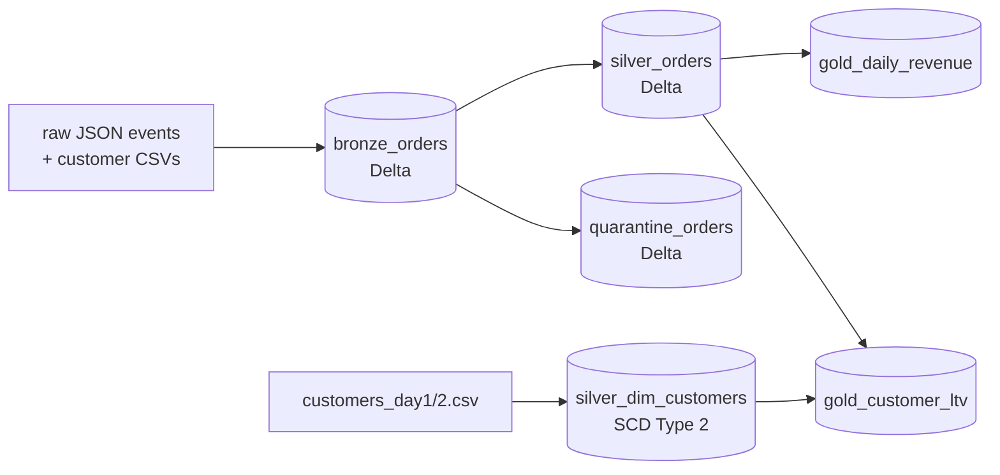

# Medallion Lakehouse Pipeline (PySpark + Delta Lake)


An end-to-end **bronze → silver → gold** lakehouse pipeline built with
PySpark and Delta Lake — the architecture pattern behind most Databricks
Lakehouse deployments. Runs fully locally on **synthetic** e-commerce data.


> All data is fictional, generated deterministically (`seed=42`).
> Nothing here is real customer data.

## Architecture



| Layer | What happens | Delta Lake feature used |
|---|---|---|
| **Bronze** | Raw JSON landed as-is, `_ingest_ts` + source file added | Schema evolution absorbs the mid-stream `promo_code` field |
| **Silver** | Dedupe on `order_id`, quarantine bad rows with a reason, typed casts | ACID writes, quarantine table |
| **Silver dim** | Customer dimension merged across two snapshots | `MERGE INTO` for SCD Type 2 |
| **Gold** | Daily revenue by category, customer lifetime value | Aggregations ready for BI |

The generator injects realistic messiness on purpose: ~2% duplicate events,
~1% negative quantities, ~1% unknown customers, and a schema change halfway
through the stream. The pipeline is expected to absorb all of it.

## Run it

```bash
pip install pyspark delta-spark
python3 data/generate_orders.py        # synthetic raw data
PYTHONPATH=src python3 src/run_pipeline.py
```

Expected output (counts vary slightly with the seed):

```
[bronze] 3060 raw events -> warehouse/bronze_orders
[silver] 2941 clean orders -> warehouse/silver_orders; 59 quarantined -> warehouse/quarantine_orders
[scd2] data/raw/customers/customers_day2.csv: 500 current, 49 historical -> warehouse/silver_dim_customers
[gold] 183 daily rows -> warehouse/gold_daily_revenue; 498 customers -> warehouse/gold_customer_ltv
```

Each step also runs standalone (`PYTHONPATH=src python3 src/bronze_ingest.py`, …).

## Files

- `src/bronze_ingest.py` — raw JSON → bronze Delta
- `src/silver_cleanse.py` — dedupe, validation, quarantine
- `src/silver_scd2.py` — SCD Type 2 customer dimension via `MERGE INTO`
- `src/gold_aggregates.py` — revenue + LTV marts
- `src/run_pipeline.py` — orchestrates everything, prints a summary
- `data/generate_orders.py` — synthetic data generator

## Author

**Geetha Gunda** — Solutions Engineer working on cloud data & lakehouse
platforms (Databricks, AWS, Delta Lake, Spark, SQL, Python).
